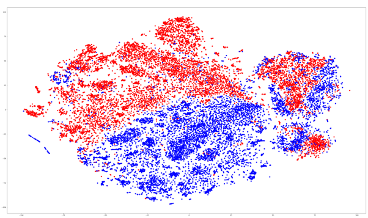

# Background

Ontologies play a crucial role in data management and especially in life science, they have been indispensable for decades as the complexity of life science data requires rigor. Biomedical ontologies often undergo change and improvement, as e.g. disease and phenotype ontologies develop constantly along with our scientific understanding. In order to bridge the gap between ontologies and annotated datasets and thus to semantically enable applications and datasets to retrieve insights and improve interoperability, ontology mapping plays a key role [1]. 

To implement a sophisticated search supported by semantics, interoperability to address cross-disciplinary needs is crucial. In this paper we focus on different aspects of interoperability of ontologies, especially in the phenotype and disease domain and how they could be improved: 

One aspect is not technical but linguistic and social interoperability - improving the usage and understanding of datasets through translation of ontologies into other languages like Japanese. While this might not seem challenging at first from a scientific or mathematical perspective, it is actually a very challenging task as translations in general might introduce unacceptable fuzziness: An exact translation can be viewed similarly strict as a skos:exactMatch statement in ontology matching - but sometimes such an exact translation is not possible, especially for languages from different families, e.g. Indo-Germanic, Japanese or Arabic.   

Another aspect of this paper is the interoperability between the HPO and Mammalian Phenotype Ontology (MP) on a technical and structural level. These ontologies are very important to harmonise human data and model animal data, e.g., to maximise the outcome  from previous experiments with model organisms to minimise the sacrifice of animals. Ontology mapping is a hard problem in general and especially in the case of HPO and MP very challenging. However, modern life sciences are strongly expected to contribute to medical science, but the phenotypic vocabulary used for many model organisms is different from that used in medical science -thus mapping data between Human Phenotype Ontology (HPO) and phenotypic ontologies of each model organism research field has been implemented in many databases to meet the needs of searches across research fields [2, 3, 4]. 

In addition to data searching, a bird's-eye understanding of the data set is important for scientists. Users not only want detailed information on individual pieces of information, they also want to know where their interest targets within their own research area. The need for good overview and easy understanding of the overall and partial structure of the data for clinicians and biologists working in a variety of fields is also a major challenge that cannot be ignored. Depending on the domain and site of use, synonyms and definitions can vary which would not be noticed without communication with the end users. Ontology can help understanding the domain’s knowledge by providing vocabularies or terms with their classification and relationships.

Because of this multifaceted nature of the problem, a multidisciplinary hackathon that includes not only linguists and informaticians, but also clinicians and life scientists is an excellent opportunity to share current status and identify challenges for the future. During the BioHackJP 2023, a variety of approaches were discussed and evaluated. In this paper, we report overviews of the result of each investigation and discuss future works to address these challenges.

# Ontology translation to Japanese - current status and issues 

## Background
Since March 2023, the Database Center for Life Science (DBCLS) has provided a Japanese version of the Mammalian Phenotype Ontology (MP), which can be accessed at https://github.com/dbcls/MP_Japanese. 

The translation of MP into Japanese serves several crucial purposes. It accelerates the phenotypic annotation of genomic data within Japan, fosters international (re)use of phenotypic annotations generated by Japanese researchers, facilitates Japanese researchers in readily (re)using internationally annotated phenotypic annotations, and contributes to the broader field of mammalian research. The translation process involved machine translation, followed by meticulous manual curation and also experts to oversee the incorporation of genetics and medical terminology were included. During this process, it became clear that when translating ontologies to other languages like Japanese, the specific characteristics of this language needs to be considered and respected.  

## Outcomes
Ontologies rely on precision and correctness and thus translating languages as distant as English and Japanese, can be very challenging. Japanese has multiple types of characters, kana summarises the character set hiragana and katakana – both represent the same sounds and so one could think to use them interchangeably, but that is not the case. 
 The context matters in order to recognize the symbol correctly as words might be pronounced the same way in Japanese but have different meanings and different character sets might be used - depending on how they are used or who uses them. See figure 1 for concrete examples. 
Kanji characters are different from kana as they do not represent syllables but concrete words or concepts. Therefore there are many thousands of characters in kanji, which have to be memorized. 

Figure 1: Japanese words with the same pronunciation but different meanings

Also within a character set, context is important. For example, while the word ‘male’ is used in English to describe the sex of both mammals and humans, this is not the case in Japanese - different symbols are used to express the gender of animals than of humans (see figure 2). 

Figure 2: Examples of using different symbols within the same character set (Kanji) for the same English word in Japanese - depending on the context

Naturally, the complexity of the Japanese language hinted at above poses problems to automatic machine translation. Tools like Google Translate and DeepL are used to support the translation efforts, however – manual curation is crucial to ensure high quality. See figure 1 for the proposed workflow to translate HPO and MP from English to Japanese.
 

Figure 3: Proposed workflow for HPO/MP translation, taken from “Choosing preferable labels for the Japanese translation of the Human Phenotype Ontology” [8] 

# Improving ontology alignments and mappings

Background
To align ontologies and to find mappings between ontologies is a well described and relevant problem to boost interoperability, however it is still very challenging. The definition of “mapping” or “match” is often interpreted very differently by different people. Strictly speaking, an “exact match” means that two concepts can be used interchangeably. To describe other types of relationships, other properties could be used like skos:broader, skos:narrower or skos:related - to determine the exact type of a mapping can be very challenging automatically and usually, to create a “gold standard”, manual curation and manual quality control of domain experts is needed.   

To capture mappings and their provenance in a standardised way, recently SSSOM, a common standard for sharing ontological mappings was proposed [cite https://doi.org/10.1093/database/baac035]. The core data model of SSSOM is rather simple, as mappings are often exchanged in a tabular format. However, to come to an agreement on which metadata fields are important to capture and store those in a standardised way is a major advantage. Furthermore by agreeing on a standard and including important stakeholders from the start, SSSOM truly helps to align the community. For example, EMBL-EBI’s Ontology Lookup Service or the Mondo ontology started to include/export mappings as SSSOM. There are software packages developed to work with SSSOM and a governance structure in place to oversee future changes and development of the standard. The preferred way to raise issues or ideas is the SSSOM github repository (https://github.com/mapping-commons/sssom).   

Outcome 

During the biohackathon SSSOM was discussed and proposed as a way to share ontological mappings that might be created in the future. We discussed the difficulties of translating one ontology earlier in this paper, however if we look in addition to multilinguality  also at mappings between ontologies, there clearly is an additional layer of complexity - not only should the translations to e.g. Japanese be correct for each ontology, ideally also the mappings between these ontologies needs to be considered (e.g. exactMatch is a strong semantic statement, so does this also hold for the translated terms?).

Furthermore, ontology mappings between HP and MP from different sources were used to support the following sections of this paper-  which underlines the importance of mappings for data integration and data analysis. 

# Differences of categorical layer Odependent on view points

## Background
Here, we examined how HPO and MPO are perceived by the end-users, who are closest to the field, from a structural point of view, referring to the opinions of clinicians and medical researchers who have many years of experience in behavioural studies using mice. At first, we attempted to examine whether there are differences in the structure of the ontology between HPO and MPO. To address this, we extracted terms in each layer of the ontologies to analyse the structure of HPO and MPO, and features between each step between the layers. We identified several structural differences within the ontologies that make mapping challenging.
① High-level classification：In the 1st layer, most highest concepts were listed based on anatomy, systems and time-points etc. We found that even in the 1st layer there are 6 differences between HPO and MPO after manual mapping. Among the 6 different terms, one was in the HPO (constitutional symptoms) and the others in MPO (normal phenotype, mortality/aging, no phenotypic analysis). Some of the higher concepts were divided into lower concepts in HPO but not in MPO.
② Step：The number of layers and the numbers of terms in each layer will be dependent on the complexities of anatomy, systems and time-points etc. For example, the number of terms in 8th layer, HPO is 4877 but MPO is 2394, showing substantial differences between ontologies. In addition to the high-level classification differences, the classification of the lower concepts are not consistent between both ontologies. 
③ Granularity：When the above two issues are combined, the endo-phenotype at the same granularity is placed on different layers of the  two ontologies, making it challenging to visualise terms of the same granularity on the same layer, leading to intuitive understanding. These differences in granularity makes it difficult for clinicians and model organism researchers to communicate.

## Outcomes
Our observation reveals that there are several structural differences between the ontologies. These structural differences may be a barrier to collaboration with domain experts which will affect further mapping and collaborative validation. Furthermore, our analysis also identified some areas that can be improved:
1: Mapping key high-level concepts：One of the main uses of aligned phenotype ontologies is the inter-species phenotype translation, in particular between human and model organisms. After the phenotype translation, researchers will often move on to analyse more details in model organisms. Since perfect ontology mapping may be impossible when considering two different species, one alternative would be to focus on high-level concepts primarily as these allow access to the more fine-grained phenotype terms in either ontology. However, even in this choice, granularity of terms is important and needs to be considered in the alignment. 
2: Layer alignment for endo-phenotypes：The endo-phenotypes are the detailed descriptions of phenotypes Therefore, aligning each individual layer based on the endophenotypes that are represented would be helpful to ensure that the same distinctions are being made. However, this also requires detailed understanding of each term in the context of the classification criteria used and therefore the  branching of the taxonomy.
While these two approaches maybe possible, it requires substantial revision of the two ontologies. However, the issues we identify not only exist in HPO and MP, but also in alignments of other ontologies. Therefore, finding a solution to these problems would be useful in other mapping efforts as well. 

Figure 4:

# HPO-MP definition analysis with LLM

## Background
Large Language Models (LLMs) such as LLaMA and GPT have demonstrated that they are able to capture the meaning of natural language expression. We used LLMs to generate embeddings of the definitions of classes in HPO and MP, and then used the generated embeddings to determine whether the definitions are semantically similar; to determine semantic similarity, we compared the embeddings of the definitions using a vector similarity measure. This approach can be used for matching classes from HPO and MP by computing the pairwise similarity between them, and then, for each class from one ontology, rank all classes from the other ontology; we can evaluate this approach by determining where correctly matching classes (if any) are ranked.

## Outcomes
We implemented a sentence embedding model using the Python transformers library based on the bert-base-uncased pre-trained model. We obtained all definitions for classes from HPO and MP and generated a phrase-level embedding; to achieve this goal, we used the transformer to generate an embedding for each word and then aggregated the embeddings using the mean aggregation to generate the phrase embedding. To determine similarity, we used either cosine similarity or the Euclidean distance.

Fig.5 shows a TSNE for the generated embeddings. As can be seen in the figure, there is a relatively strong separation between MP and HPO definitions, demonstrating that they are different and not recognized as very similar. One of the reasons for this separation may be that MP definitions are often substantially shorter and may not always be formulated as a full sentence, whereas definitions in HPO are full sentences and may even span multiple sentences. 

Figure 5: TSNE visualization of the embeddings generated from definitions in HPO and MP. Embeddings derived from MP are shown in blue, from HPO in red.
Github Link: https://github.com/leechuck/biohack23 

# LLM based Alignment workflow suggestions for axioms, labels, and definitions for HPO and MP

## Background
The challenge in cross-species phenotypic mapping and alignment is handling species-specific differences. In order to overcome difficulties, it is necessary to consider semantic similarity beyond mere label matching. This study investigated whether Large Language Models (LLMs) support cross-species phenotypic ontology alignment toward interoperability between phenotype and disease. We used ChatGPT / GPT-4 and explored the performance to compare HPO and MP ontologies.

## Outcomes
1.Ontology alignment evaluation  
First, if no ontology information was not given, such as definitions or subclasses, ChatGPT made comparative evaluations based on label matches. In addition, asking ChatGPT to consider the semantic similarity, the evaluation scores varied widely over three trials since the evaluation was based on pre-trained general knowledge independent of domain-specific ontologies. Next, in addition to the labels, we gave the information on the definitions in each ontology using annotation properties in OWL. As a result, comparative evaluation was possible regarding their semantic similarity. Furthermore, logic-based evaluation was possible using owl:equivalentClass, even if their labels were different. For example, whereas MP:0002544 brachydactyly has a different label than HP:11927 Short digit, GPT-4 rated their similarity scores as high since their owl:equivalentClass axioms show both of which have part ‘decreased length’ and inhere in ‘digit’  described in the same Entity-Quality (EQ) manner.

In summary, ChatGPT/GPT-4 can be applied to evaluating ontology alignment. Whereas AI hallucinations are problems, prompt learning using logical definitions of ontology will contribute to helping reduce risks and be more cost-effective than fine-tuning. 

2.Towards alignment with consideration of disease interoperability
The differences in granularity between HPO and MP hierarchies cause difficulties in ontology alignment. For example, HPO HP:001156 Brachydactyly has more rich subclasses of some distinct patterns of shortened digits (brachydactyly types A-E) dependent on disease classification. Therefore, developing a core reference ontology from general to species-specific layers is desirable concerning ontology alignment. The Unified phenotype ontology (uPheno) [12] is a good candidate ontology. However, uPheno includes a large number of entities based on structural or morphological perspectives, such as ‘abnormal blood vessel morphology’ (UPHENO_0020584), ‘abnormal artery morphology’ (UPHENO: 0019771), and ‘abnormal systemic artery morphology’ (UPHENO: 0020587), as well as entities based on functional abnormalities (such as ‘arterial stenosis’). Combining these entities in a single hierarchy leads to differences in what distinguishes subclasses, and potentially also differences in granularity. These differences make it more challenging to comprehend ontology content, and may also limit our ability to find diseases by semantic similarity.  An alternative is to structure phenotypes in single hierarchies based on common classification criteria 　(Fig.6).

Figure6: Ontology alignment with multiple ontologies and biomedical terminologies. PATO hierarchy is green, HPO hierarchy is right blue, MP is green, uPheno is pink, MeSH is yellow, DOID is orange, and the desirable reference ontology is blue.  
The Homeostasis Imbalance Process ontology (HoIP) [13, 14] consists of three layers: a domain-independent layer, a biomedical dependent layer, and a homeostasis imbalance-dependent layer. HoIP utilises PATO, HPO, the anatomy ontology UBERON, the Symptom Ontology, and the Disease Ontology (DOID) in the biomedical dependent layer. Therefore, the HoIP schema may contribute to ontology alignment.　While HoIP is based on manual annotation, we intend to evaluate the use of LLMs to automate part of the HoIP curation in the future. 

# Exploration of model mice relevant to human phenotypes and diseases by leveraging HPO and MP

## Background

The RIKEN BioResource Research Center (BRC) is constructing a bioresource knowledge graph (KG) [15]. The users can explore their bioresources (e.g., RIKEN BRC mice relevant to specific MP terms) for the KG. Leveraging human phenotype and disease information, we aimed to expand the information on model mice expected to be used for health care and medical research.　　　
We collected external public data, integrated these data with the bioresource KG in the triple store: BioResource MetaDatabase, and executed a SPARQL query to explore model mice as follows.
- Collecting the existing HPO-MP mapping data (see Supplemental data 1, 2)
- Generating the HPO-MP RDF data from the HPO-MP mapping data.
- Integrating the Bioresource KG with the HPO-MP RDF data and HPO annotation data within the Monarch KG (Fig.4).
- Executing a SPARQL query for the integrated bioresource KG to explore model mice relevant to human phenotype and diseases on the Bioresource SPARQL endpoint.

## Outcomes
We obtained 1875 mice relevant to 8834 HPO terms and 1846 mice applicable to 7833 OMIM and 4259 Orphanet Rare Disease Ontology (ORDO) terms (Fig.4). However, we could not define the 1846 mice as disease models because the mice just related to human phenotypes associated with diseases.

Figure7: Results of ontology term mapping to the RIKEN model mice.

# Future work

In this paper, we examine six critical issues related to ontology interoperability, translation to multiple languages, the relationships among terms across diverse ontologies, and the use of LLMs for ontology interoperability. These issues were probed during an international hackathon that assembled a varied set of researchers from distinct life science communities. Our findings underscore the interconnectedness of these issues and suggest that they require a comprehensive solution. One recommendation is to redesign the hierarchical structure of ontologies. This restructuring aims to standardise translations across ontologies, establish accurate term relationships, and facilitate a high-level understanding of the ontology.  How to organize the layer is a big challenge, however, this is one of the fundamental problems that exists  in every ontology. To address these issues we need to combine several methods including the compression of layers with terms based on the concept or newly annotated tag etc. 

We also observed the necessity for multi-dimensional improvements in interoperability that can transcend various domains such as species, disciplines, and both human-computer and computer-computer interactions. Although many software applications have adopted ontology visualization based on rdfs:subClassOf links, this approach is often inadequate for biomedical researchers. The field of ontology research acknowledges that human understanding varies across different categorical layers, influenced by perspective and context. Despite existing research on dynamic data structures and methodologies, the biomedical sector still lacks extensive, user-friendly ontology tools. Therefore, the development of intuitive visualization software, along with the refinement of ontology knowledge structures, is imperative.

To address these challenges, we advocate for the development of next-generation ontologies that incorporate machine learning and language models. These advanced systems could offer flexible, specialized information while maintaining a comprehensive and holistic view of the knowledge base.

The utilization of Large Language Models (LLMs) is a forthcoming imperative task. Specifically, the integration of lexical and semantic (axiom) components in mapping strategies could be beneficial. As a part of our quantitative evaluation, we intend to measure 'ChatGPT distance' to assess semantic similarity, combining natural language and logical definitions, such as EQ models in ontologies. This evaluation will contribute to the effectiveness of the existing HPO-MP mapping data, currently used for research on mice and other model organisms relevant to human phenotypes and diseases. It will also facilitate the alignment of various ontologies and the application of new mappings for disease modeling and gene-disease associations. Moreover, an exploration of the relationships among translations, axioms, and LLM embeddings may enhance coordination between phenotype ontology developers, software engineers, and end-users in biomedical science.

In conclusion, the hackathon reaffirmed that interdisciplinary collaborations could offer diverse perspectives on a problem, thereby facilitating more comprehensive solutions. Technological advancements in this domain, including the use of LLMs, are promising and likely to provide innovative solutions to the challenges discussed herein.  The next Hackathon will continue to serve as platforms for discussing these complex issues and identifying potential solutions.

## Acknowledgements

We would like to thank the fellow participants at BioHackathon 2023 for their collaboration and constructive advice, which greatly influenced our project. We are grateful to the organizers for providing this platform and the developers of open source language models. Special thanks to our mentors, advisors, and colleagues for their guidance and support. Without their contributions, our project in linked data standardization with LLMs in bioinformatics would not have been possible.

## References

1, Ian Harrow, Rama Balakrishnan, Ernesto Jimenez-Ruiz, Simon Jupp, Jane Lomax, Jane Reed, Martin Romacker, Christian Senger, Andrea Splendiani, Jabe Wilson, Peter Woollard
Ontology mapping for semantically enabled applications
Drug Discovery Today Volume 24, Issue 10, October 2019, Pages 2068-2075
DOI: https://doi.org/10.1016/j.drudis.2019.05.020

2, Kohler S, Carmody L, Vasilevsky N, Jacobsen JO, Danis D, Gourdine JP, et al. Expansion of the Human Phenotype Ontology (HPO) knowledge base and resources. 
Nucleic Acids Res 2018;47:D1018–D1027.
DOI: https://doi.org/10.1093/nar/gky1105

3, Masuya H, Usuda D, Nakata H, Yuhara N, Kurihara K, Namiki Y, Iwase S, Takada T, Tanaka N, Suzuki K, Yamagata Y, Kobayashi N, Yoshiki A, Kushida T.
Establishment and application of information resource of mutant mice in RIKEN BioResource Research Center.
Lab Anim Res. 2021 Jan 18;37(1):6. 
DOI: https://doi.org /10.1186/s42826-020-00068-8

4, BioResource MetaDatabase: https://knowledge.brc.riken.jp/ 

5, HPO-MP RDF data: https://github.com/kushidat/outcomes_BH23/blob/main/Data/hp_mp_mapping.ttl 

6, HPO annotation data: https://data.monarchinitiative.org/monarch-kg-dev/2023-06-01/rdf/index.html#:~:text=hpoa_disease_phenotype.nt.gz

7, Smith CL, Eppig JT. 
The mammalian phenotype ontology: enabling robust annotation and comparative analysis. Wiley Interdiscip Rev Syst Biol Med. 2009 Nov-Dec;1(3):390-399. doi: 10.1002/wsbm.44. PubMed PMID: 20052305; PubMed Central PMCID: PMC2801442.

8, Kota Ninomiya, Terue Takatsuki, Tatsuya Kushida, Yasunori Yamamoto, Soichi Ogishima
Choosing preferable labels for the Japanese translation of the Human Phenotype Ontology
Genomics & Informatics 2020; 18(2): e23.
Published online: June 18, 2020
DOI: https://doi.org/10.5808/GI.2020.18.2.e23

9, Nicolas Matentzoglu, James P Balhoff, Susan M Bello, Chris Bizon, Matthew Brush, Tiffany J Callahan, Christopher G Chute, William D Duncan, Chris T Evelo, Davera Gabriel, John Graybeal, Alasdair Gray, Benjamin M Gyori, Melissa Haendel, Henriette Harmse, Nomi L Harris, Ian Harrow, Harshad B Hegde, Amelia L Hoyt, Charles T Hoyt, Dazhi Jiao, Ernesto Jiménez-Ruiz, Simon Jupp, Hyeongsik Kim, Sebastian Koehler, Thomas Liener, Qinqin Long, James Malone, James A McLaughlin, Julie A McMurry, Sierra Moxon, Monica C Munoz-Torres, David Osumi-Sutherland, James A Overton, Bjoern Peters, Tim Putman, Núria Queralt-Rosinach, Kent Shefchek, Harold Solbrig, Anne Thessen, Tania Tudorache, Nicole Vasilevsky, Alex H Wagner, Christopher J Mungall
A Simple Standard for Sharing Ontological Mappings (SSSOM) 
Database, Volume 2022, 2022, baac035
DOI: https://doi.org/10.1093/database/baac035

10, Matthias Griese, Matthias Haimel, Julia Pazmandi, Marc Hanauer, Nomi L Harris, Michael J Hartnett, Maximilian Hastreiter, Fabian Hauck, Yongqun He, Tim Jeske, Hugh Kearney, Gerhard Kindle, Christoph Klein, Katrin Knoflach, Roland Krause, David Lagorce, Julie A McMurry, Jillian A Miller, Monica C Munoz-Torres, Rebecca L Peters, Christina K Rapp, Ana M Rath, Shahmir A Rind, Avi Z Rosenberg, Michael M Segal, Markus G Seidel, Damian Smedley, Tomer Talmy, Yarlalu Thomas, Samuel A Wiafe, Julie Xian, Zafer Yüksel, Ingo Helbig, Christopher J Mungall, Melissa A Haendel, Peter N Robinson
The Human Phenotype Ontology in 2021
Nucleic Acids Research, Volume 49, Issue D1, 8 January 2021, Pages D1207–D1217 
DOI: https://doi.org/10.1093/nar/gkaa1043

11, Mouse Genome Informatics: https://www.informatics.jax.org/index.shtml

12, uPheno: https://obophenotype.github.io/upheno/

13, HoIP: https://bioportal.bioontology.org/ontologies/HOIP

14, Yuki Yamagata, Tsubasa Fukuyama, Shuichi Onami, Hiroshi Masuya
Ontology for Cellular Senescence Mechanisms
bioRxiv 2023.03.09.531883
DOI: https://doi.org/10.1101/2023.03.09.531883

15, Kushida T, Mendes de Farias T, Sima AC, Dessimoz C, Chiba H, Bastian F, Masuya H. Exploring Disease Model Mouse Using Knowledge Graphs: Combining Gene Expression, Orthology, and Disease Datasets. 
bioRxiv 2023.08.30.555283
DOI: https://doi.org/10.1101/2023.08.30.555283

16, BioResource MetaDatabase: https://knowledge.brc.riken.jp/ 

17, HP-MP RDF data: https://github.com/kushidat/outcomes_BH23/blob/main/Data/hp_mp_mapping.ttl 

18, HPO annotation data: https://data.monarchinitiative.org/monarch-kg-dev/2023-06-01/rdf/index.html#:~:text=hpoa_disease_phenotype.nt.gz 

19, SPARQL query for the integrated bioresource KG: https://github.com/kushidat/outcomes_BH23/blob/main/QueryExample/bh23_sparal_querty_example01.txt 

20, Bioresource SPARQL endpoint: https://knowledge.brc.riken.jp/sparql 

## Supplemental data

Supplemental data 1: Collected HP-MP mapping data including ZP, and WBP. They include 14,902 HP-MP mapping data in total.
 - 1 uPheno2 [HP-MP]: http://obofoundry.org/ontology/upheno.html 
 - 2 mp_hp-align equiv [HP-MP]: https://github.com/obophenotype/upheno/blob/master/hp-mp/mp_hp-align-equiv.owl 
 - 3 Mapping commons (mh_mapping_initiative) [HP-MP]: https://github.com/mapping-commons/mh_mapping_initiative 
 - 4 HP-MP SSSOM [HP-MP]: https://github.com/mapping-commons/sssom 
 - 5 uPheno [HP-MP, HP-ZP, and HP-WBP]: https://github.com/obophenotype/upheno 

Supplemental data 2: Overview of the HP-MP mapping data (excluded uPheno data): https://github.com/kushidat/outcomes_BH23/blob/main/Figure/Overview_of_HP-MP_mapping_data.png 

Supplemental data 3: Phenotypic data between model organism and human: https://github.com/kushidat/outcomes_BH23/blob/main/Figure/phenotypic_data_between_model_organism_and_human.png 
